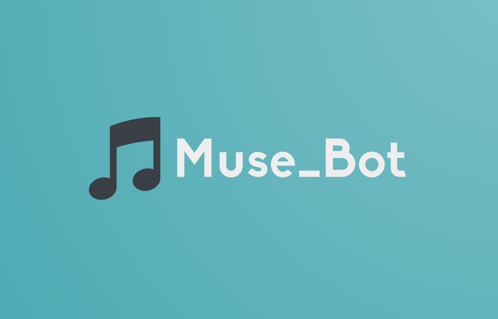
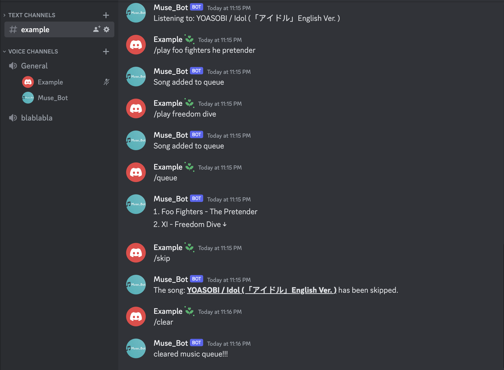
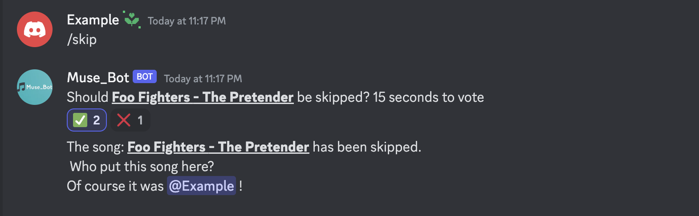
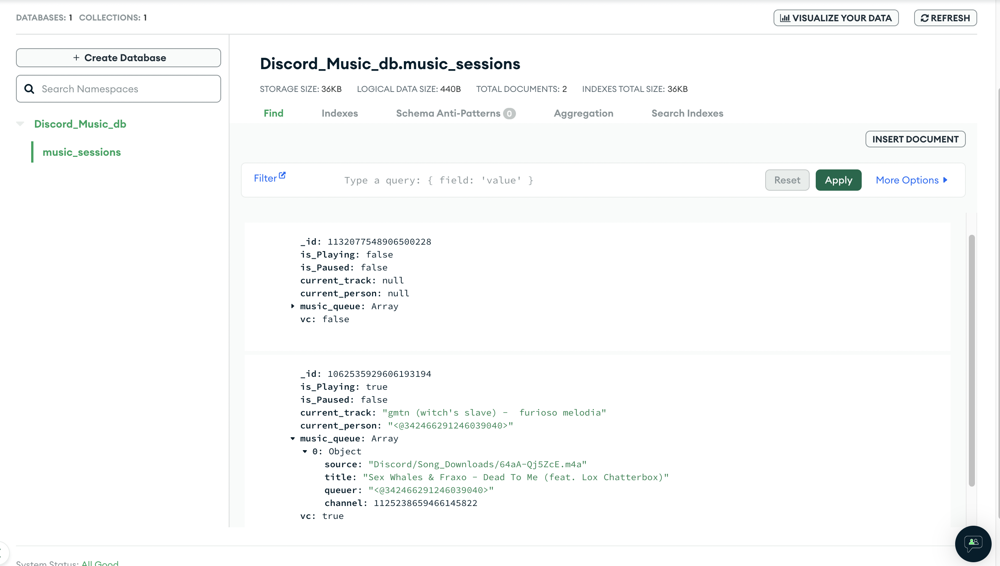
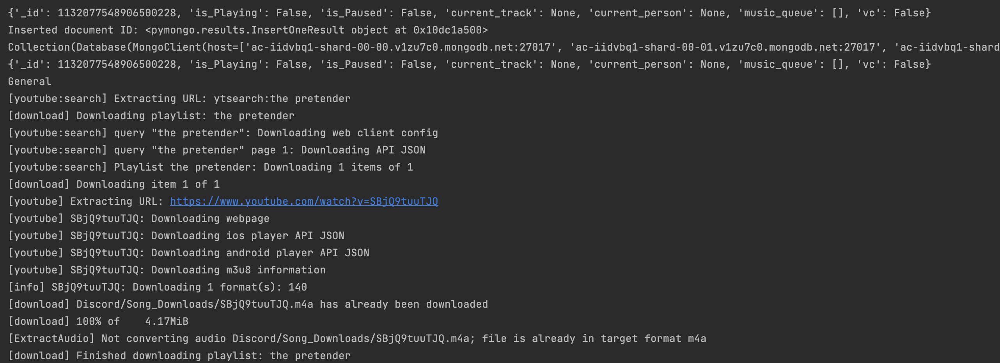

# <u> Muse_Bot </u>
##

A multi-server music bot for all your music needs!
Muse_Bot powerful and feature-rich bot developed to 
enhance your Discord server experience. 

---

## Languages
- Python

## Technologies Used

- Discord Developer Tools
  - PyNaCl
  - Discord.py
- FFMPeg
- Youtube-DLP
- Database
  - MongoDB Atlas
  - pymongo
 
---
## Features

- Command Prefix: The bot listens for commands starting with "/"

General Commands:
- **/help** - list of commands 
- **/p or /play [URL] or [search words]** - play a song!
- **/q or /queue** - see whats playing next!
- **/skip** - skip song
- **/remove [number in queue]** - removes queued song
- **/clear** - clear all songs
- **/dc** - kick bot from channel
- **/pause** - pauses song
- **/resume** - resumes song
- **/now_playing or /np** - shows what is currently playing

For the skip and remove features:
 

You can vote to see if the song should be skipped or removed from queue

---
## How it works

- Store all state values within MongoDB Atlas

- YouTube - DLP/MongoDB Documents
   

